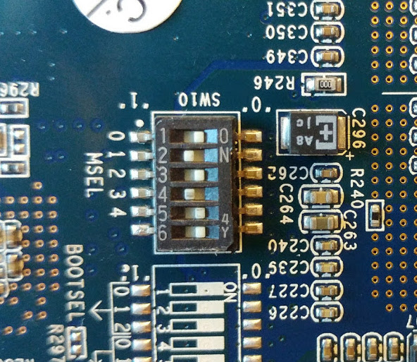

# DE1 SD Card Image

We provide a SD Card image with binaries to run on the board. We will also provide a larger image with the source code in the future.

Notes:

* This image will only work for the [Terasic DE1 SoC board](http://www.terasic.com.tw/cgi-bin/page/archive.pl?Language=English&No=836).

* It contains the benchmark data used in the paper, and binaries and scripts to run the application on ARM and FPGA.

## Instructions

1. Setup your board like the image below
    

1. Download the SD Card image from [this link (Google Drive link)](https://drive.google.com/file/d/19MAKcM_VG6qdcrH6Eietb2eo3klKmQeP/view?usp=sharing). Burn the image onto a SD card 16 GB or larger. Note that there is not much free space on the resulting filesystem. We will provide a 32 GB image in the future.

    On Linux, run this: (WARNING: make sure you know how to use *dd* before running it)

    ```sudo dd if=de1_image_16G.bin of=/dev/sdX bs=1M```

    Replace sdX by the actual letter of your device.

1. Plug your board to the power. Plug the UART cable to your host machine. [Optional] Plug an Ethernet cable.

1. Insert the SD card and start the board.

1. On your host machine, connect to the board using UART with the program of your choice. We use the *screen* command that you can use this way:

    ``` sudo screen /dev/ttyUSB0 115200 ```

1. The OS may take some time to start. When it asks for login (*de1opencl login*), enter "root", then password "root".

1. *[Optional, but very highly recommended]* Get the IP address of your board by running `ifconfig`. Disconnect from UART and login through SSH: `ssh root@111.111.111.111`

1. Go into the *bin* folder and run one of the scripts. There are 6 scripts per benchmark, including 5 running different algorithms on the FPGA, and 1 running the whole process on the ARM processor. Optionally, when the algorithm is done, you can run the `process_output.sh` script to process the output of the algorithm into a proper point cloud. Note that this process is not optimized and extremely slow on ARM. We will provide the source code ASAP so it can be run on the host machine. The processed output can be visualized using the `pcl_viewer` application from the PCL library on a host machine.


Note that the results can partially depend on the speed of your SD card. 
